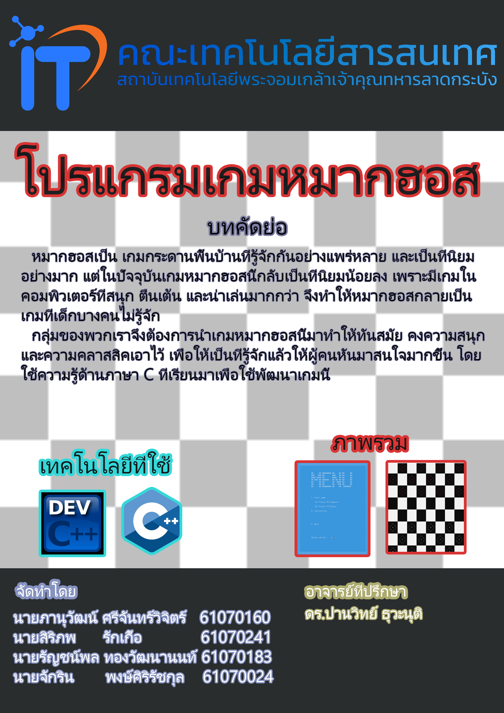
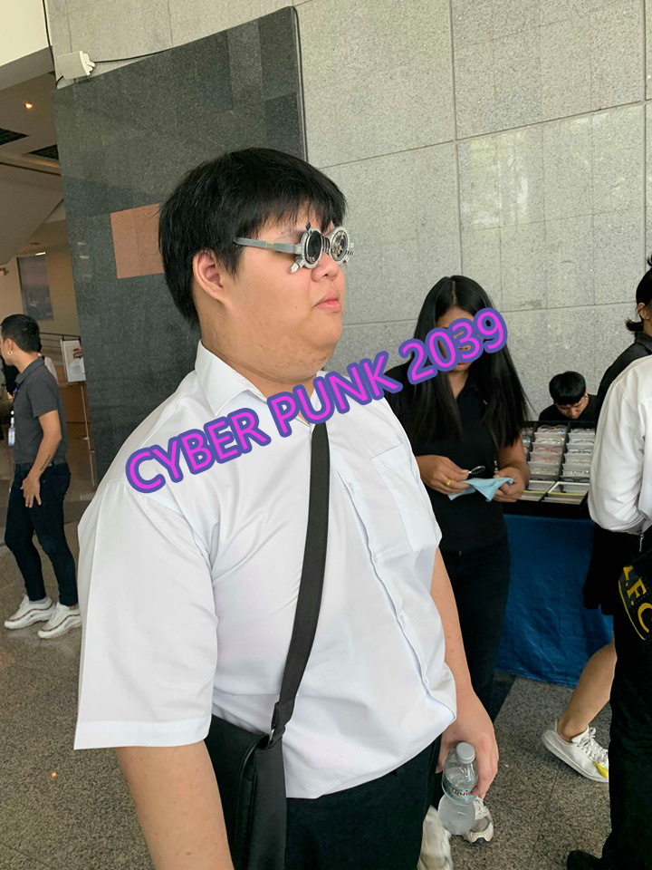

# Poro-So-Cute-Project-Computer-Programing61-
##  หมากฮอส 

## บทคัดย่อ
 &nbsp;&nbsp;&nbsp;&nbsp;&nbsp;&nbsp;&nbsp;&nbsp;&nbsp;&nbsp;หมากฮอสเป็น เกมกระดานพื้นบ้านที่รู้จักกันอย่างแพร่หลาย และเป็นที่นิยมอย่างมาก แต่ในปัจจุบันเกมหมากฮอสนี้กลับเป็นที่นิยมน้อยลง เพราะมีเกมในคอมพิวเตอร์ที่สนุก ตื่นเต้น และน่าเล่นมากกว่า จึงทำให้หมากฮอสกลายเป็นเกมที่เด็กบางคนไม่รู้จัก 
 &nbsp;&nbsp;&nbsp;&nbsp;&nbsp;&nbsp;&nbsp;&nbsp;&nbsp;&nbsp;กลุ่มของพวกเราจึงต้องการนำเกมหมากฮอสนี้มาทำให้ทันสมัย คงความสนุกและความคลาสสิคเอาไว้ เพื่อให้เป็นที่รู้จักแล้วให้ผู้คนหันมาสนใจมากขึ้น โดยใช้ความรู้ด้านภาษา C ที่เรียนมาเพื่อใช้พัฒนาเกมนี้
## โปสเตอร์

## ผลงานของเรา
### &nbsp;&nbsp;&nbsp;&nbsp;&nbsp;&nbsp;&nbsp;&nbsp;&nbsp;&nbsp;[!!!คลิกเลย!!!](https://youtu.be/7PtdFGxHzC8)
## สมาชิก
| Profile | รหัสนักศึกษา        | ชื่อ - นามสกุล | Github |
|:---------:| :-------------: |:---------------------:| :-------------: |
|  | 61070183    | นายรัญชน์พล ทองวัฒนานนท์ | [Runchapol](https://github.com/Runchapol) |
|  | 61070024    | นายจักริน พงษ์ศิริรัชกุล | [nueng2542](https://github.com/nueng2542) |
|  | 61070160    | นายภาณุวัฒน์ ศรีจันทร์วิจิตร | [Parnuwat](https://github.com/puninw001) |
|  | 61070241    | นายสิรภพ รักเกื้อ | [Sirapop](https://github.com/SirapopJayz) |
## อาจารย์ที่ปรึกษา
- ดร. ปานวิทย์ ธุวะนุติ
 &nbsp;&nbsp;&nbsp;&nbsp;&nbsp;&nbsp;&nbsp;&nbsp;&nbsp;&nbsp;รายงานนี้เป็นส่วนหนึ่งของวิชา Computer Programming
 เทคโนโลยีสารสนเทศ สถาบันเทคโนโลยีพระจอมเกล้าเจ้าคุณทหารลาดกระบัง
